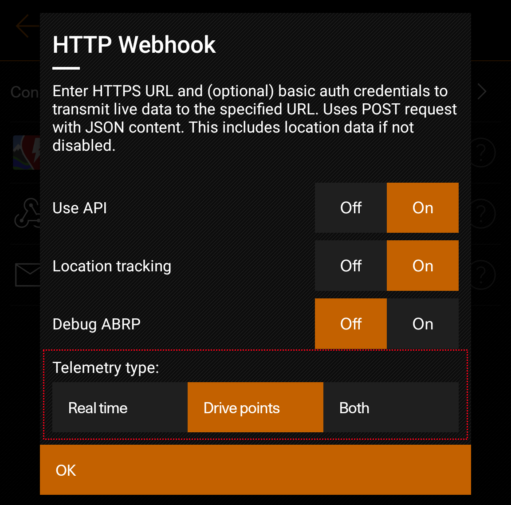

# Car Stats Viewer webhook API

## General information

The Car Stats Vier app comes equipped with a webhook API that lets users send real time driving telemetry to a RESTful API endpoint using the data formatting described in this documentation.

The app sends POST-requests wit an `application/json` payload and supports Basic Auth. The endpoint is required to support https (mandated by the Android OS).

Beginning with API version 2.1, it can be configured whether the API requests are sent in a fixed time interval, triggered by drive events like ignition changes and driven distance (same trigger as the internal data recording), or both. Details on what data is sent in in these cases is described in detail below.

Keys marked as `(optional)` can be missing during normal operation. This occurs if the data is currently not relevant or for example location tracking is disabled. Endpoints should not expect these values to always exist!

### Backwards compatibility 

To make sure your endpoint supports the current version of the API, every request contains information about the API- and app-version. 

In general, major versions are incompatible. This means that keys were either removed or the data format has changed. Minor versions however only extend the current major version. Endpoints with a lower minor version can receive requests from a higher minor version without a problem.

For example:
* With the jump from 1.0 to 2.0 the data structure has changed significantly and older endpoints are not capable to process data.
* The update from 2.0 to 2.1 adds additional data, but keeps everything from 2.0. Endpoints tailored for 2.0 can receive 2.1 requests and just ignore the new keys.

## API versions

### 2.1 (App version 0.25.2 and above)

API version 2.1 extends version 2.0 (see below) by some more optional values. These aim to be more complete than just plain real time values. The data is identical to the data saved to the local database of Car Stats Viewer. To receive these new values they have to be enabled in the Car Stats Viewer API settings:



Telemetry type:
* Real time: Same behaviour as in version 2.0.
* Drive points: Requests are only sent when drive points are written to the local data base (generally every 100m).
* Both: Combines both behaviours. 

If enabled, drive points are queued. When the car has no internet connection this queue grows until connectivity is restored. The queue is then sent in bulk so no data is lost.

Also, from within the trip history in the CSV app, you can send the entire data base at once. This may take some time, so please wait on this screen until a notification appears. This can be used to sync the local app data base and the data stored on a server.

The following keys have been added:

```json5
"drivingPoints": [
    {
        "alt": 0,                                   // altitude above sea level in m (optional)
        "distance_delta": 19.714678,                // driven distance since the last driving point in m
        "driving_point_epoch_time": 1696070487231,  // epoch time in ms
        "energy_delta": 45.35667,                   // used energy since the last driving point in Wh
        "lat": 32.827896,                           // (optional)
        "lon": 7.4446335,                           // (optional)
        "point_marker_type": 2,                     // 1: Start of drive, 2: end of drive (optional)
        "state_of_charge": 1.0                      // state of charge (0.0 - 1.0)
    }, 
    // ...
]
```

This key represents driving points sent every 100m or at the start and end of a drive. It is suitable to calculate distances, average speeds and consumptions.

```json5
"chargingSessions": [
    {
        "chargeTime": 51608,                  // duration of the charging session in ms
        "charged_energy": 932.0753670833333,  // sum of charged energy
        "charged_soc": 0,                     // charged state of charge (0.0 - 1.0)
        "chargingPoints": [                   // array of charging points
            {
                "charging_point_epoch_time": 1696071422457,
                "charging_session_id": 9,
                "energy_delta": 0,            // energy delta since the last charging point in Wh
                "point_marker_type": 1,       // (optional)
                "power": -0,                  // current power in mW (negative values mean charging)
                "state_of_charge": 1          // state of charge (0.0 - 1.0)
            },
            //...
            {
                "charging_point_epoch_time": 1696071462475,
                "charging_session_id": 9,
                "energy_delta": -118.06343,
                "power": -85000000,
                "state_of_charge": 1
            },
            //...
            {
                "charging_point_epoch_time": 1696071474068,
                "charging_session_id": 9,
                "energy_delta": 0,
                "point_marker_type": 2,
                "power": -0,
                "state_of_charge": 1
            }
        ],
        "charging_session_id": 9,          // unique session id
        "end_epoch_time": 1696071474074,
        "lat": 32.827896,                  // (optional)
        "lon": 7.4446335,                  // (optional)
        "outside_temp": 0,                 // temperature in °C
        "start_epoch_time": 1696071422439
    }
],
```

This key represents a charging session. It contains all necessary data to construct a charge curve. Keep in mind that CSV is only able to collect data while the car's infotainment system is active. If it is inactive during charging, sums and averages are not correct! It is sent at the end of a charging session. CSV is able to merge charging sessions if they are less than 5 minutes apart. The API then sends this key again. Check for identical `charging_session_id` to override already existing but outdated versions of the same charging session on your server.

Both of these new keys are optional. Depending on the app settings they are not contained in every request and the endpoint should not expect them to always exist. Also these keys are arrays and may contain more than just one set of data.

### 2.0 (App version 0.25.0 and above)

The API version 2.0 sends the following data:

```json5
{
    "alt":0,                        // altitude above sea level in m (optional)
    "ambientTemperature":0,         // temperature in °C
    "apiVersion":"2.1",
    "appVersion":"0.25.2.0000",
    "batteryLevel":15000,           // battery level in Wh
    "chargePortConnected":false,
    "ignitionState":"On",
    "lat":32.827896,                // (optional)
    "lon":7.4446335,                // (optional)
    "power":-0,                     // current power in mW
    "selectedGear":"P",
    "speed":0,                      // speed in m/s
    "stateOfCharge":1.0,            // state of charge (0.0 - 1.0)
    "timestamp":1696069418482       // epoch time in ms
}
```

By default these values are sent every 5 seconds and represent the current state of the car. So there is no rounding or averages.

---

### 1.0

This was the first version of the webhook API. It is deprecated since CSV now uses different methods for collecting and saving data.
